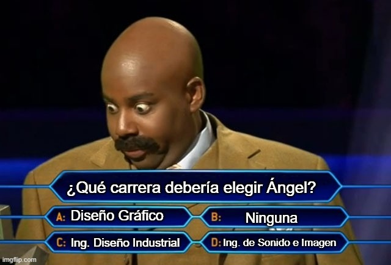
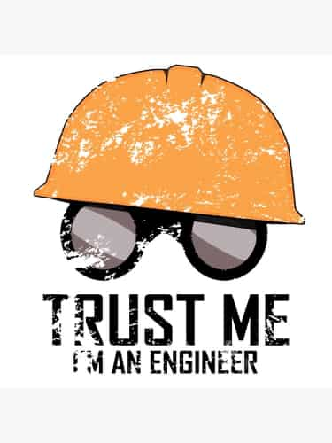
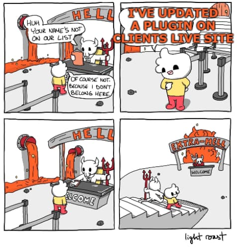

Esta segunda parte de mi "biografía" habla un poco del proceso de elegir carrera y un poco mi experiencia durante la carrera.

En este articulo solo quiero compartir un poco cual ha sido <strong>mi experiencia y como empecé mi carrera como desarrollador</strong>, con esto no estoy intentando imponer que mi manera de hacer las cosas sea la adecuada, cada persona es un mundo y tiene condiciones distintas, sino ayudar a otros con mi experiencia y reflexiones. Yo me sentí muy perdido durante todo el camino.  

He decidido dividir este artículo en diferentes partes que puedes ver aquí:
- <a href="/programar-y-disfrutar">Programar y disfrutar todo es empezar</a>
- La carrera no lo es todo
- Entrevistas, trabajo y progresión

## Elegir una carrera

No había ni empezado a programar en python y ya se acercaba el momento clave para cualquier estudiante de bachillerato que se precie, elegir una carrera. Creo que no estoy solo cuando digo que **no tenía ni idea de que elegir ni que hacer**. Programar no era ni siquiera una opción para mí, uno de mis hermanos estaba estudiando ingeniería de software y no me llamaba la atención, mejor dicho, no sabía que significaba o cuales eran las profesiones relacionadas a la ingeniería de software.

En aquel entonces estaba bastante interesado en el diseño y la ilustración en general, participaba activamente en foros de photoshop, me dedicaba a diseñar banners y carteles para webs de terceros y empezaba a disfrutar el diseño de personajes. Pero ¿Acaso uno podía plantearse encontrar trabajo en el mundo del diseño? No tenía ni idea. Elegir algo con 18 años, 0 experiencia real y una introducción a las carreras o al mundo laboral nulo, es una mala decisión. Así que los que creáis que con 18 años vais a tomar la decisión más importante de vuestra vida y que va a determinar lo que vais a ser, pensadlo dos veces, **¿Podeís tomar la decisión más importante a ciegas?** El único consejo que me hubiera gustado recibir es el mismo que mi familia me dio, **la única manera de saber si es una buena o mala decisión es probando**. Y este consejo lo sigo llevando conmigo allá dónde voy.

## De diseño gráfico a ingeniería de telecomunicaciones

Con todo esto al final rellene mi solicitud de carrera con la siguiente prioridad:

1. **[Diseño Gráfico](https://www.ucm.es/estudios/grado-diseno-plan)** - Primer año que este grado se iba a impartir, temario amplio y lo suficientemente flexible para poder decidir más tarde en que quería enfocarme.
2. **[Ing. en Diseño Industrial](https://www.etsidi.upm.es/)** - Hice un bachillerato tecnológico, vi algunos videos dónde explicaban el trabajo de un diseñador industrial y me gustaba la idea de mezclar diseño con ingeniería.
3. **[Ing. de Sonido e Imagen](https://www.etsist.upm.es/estudios-ingenieria-sistemas-telecomunicaciones-madrid/grados-ingenieria-Madrid/grados-ingenieria-teleco-Madrid/grado-ingenieria-sonido-imagen-madrid)** - No sé porque seleccioné esta carrera, tenía imagen y procesado de sonido e imagen... Creo que de alguna manera relacione Ing. de Imagen con Diseño Gráfico.

Está claro que algo falla en la educación cuando la mayoría (según el instituto de estadística de mi casa) de **los universitarios acaba en una carrera sin ningún conocimiento sobre que salidas tiene o de revote** (de chiripa, sin una intención clara y como resultado de un rechazo). No se nos enseña lo suficiente que no es necesario tener una carrera, ni se habla sobre el mercado laboral... Solo se nos da una lista de carreras que han sido ordenadas por nota (que obviamente significa prestigio) y se organiza alguna jornada dónde las universidades exponen lo que hacen. La comunicación entre institutos y universidades está casi tan rota o más que la comunicación entre universidades y empresas.

Nunca fui un alumno top en el instituto, pero tampoco tuve problemas para aprobar. Para abreviar esta historia, al final acabe de revote en Ingeniería de Sonido e Imagen, que es una rama de ingeniería de telecomunicaciones. Por supuesto, no estuve conforme con el resultado así que intenté entrar de nuevo intentando convalidar asignaturas de mi grado y rellenando todo tipo de formularios para intentar cambiar. Finalmente, decidí seguir con la carrera y terminarla a pesar de que no fuera la primera que elegí... Pero oye, ¿Cómo podía saber si cualquier carrera me iba a gustar sin probarla?

## ¿Qué es una ingeniería?

Bueno, la decisión estaba hecha así que empecé la carrera, pero con una mentalidad algo negativa. Para aquellos ajenos al mundo de las ingenierías, en España **casi todas las ingenierías tienen una base muy similar** con [Cálculo](https://ocw.mit.edu/resources/res-18-001-calculus-online-textbook-spring-2005/textbook/), [Algebra Lineal](https://www.amazon.es/Linear-Algebra-Right-Undergraduate-Mathematics-ebook), [Estadística](https://www.wiley.com/en-us/Mathematical+Statistics-p-9781119385288), [Física](https://www.feynmanlectures.caltech.edu/)... pero a día de hoy creo que la mayoría ha añadido a su curriculum una serie de asignaturas dedicada a la programación (no me meto en qué tipo de programación o en que lenguaje, ya que dependiendo de la carrera esto cambia). Normalmente estás asignaturas base se imparten los dos primeros años con pequeñas dosis de la especialización que estudias, a esto lo llamo personalmente, la criba. Ese nombre es porque estas asignaturas base suelen ser las más difíciles de pasar y se ve como muchos alumnos acaban abandonando la carrera por diferentes motivos. Así que, para de verdad saber si la ingeniería que has elegido es la correcta tienen que pasar al menos 2-3 años, que es cuando has tenido la oportunidad de probar la esencia de tu ingeniería y con suerte conocer un poco de las salidas/especializaciones.

**La universidad suele ser la elección por defecto** de muchas personas que no han tenido una orientación curricular y / o se han sentido presionados por su entorno (familia, amigos...) a conseguir un diploma. Si estas en una situación parecida y lo que quieres es dedicarte al desarrollo, piensa si la carrera es el camino adecuado para lo que buscas, tal vez puedas conseguir resultados similares con un [modulo superior/medio](https://www.todofp.es/que-como-y-donde-estudiar/que-estudiar/familia/loe/informatica-comunicaciones/des-aplicaciones-web.html) o algún [otro](https://www.udacity.com/) [tipo](https://www.udemy.com/) [de](https://www.edx.org/) [educación](https://www.coursera.org/). Una carrera es una inversión más a largo plazo y puede que pase más tiempo hasta que comprendas que es lo que te gusta. 

Si al final te has decidido por la carrera **estos primeros años deberían servirte para pensar (si tienes tiempo) e intentar buscar cuáles son tus puntos fuertes**, tanto en la carrera como fuera de ella. En mi caso disfrute bastante las matemáticas de la universidad y creo que esto es porque tuve un par de profesores bastante motivados y que podían relacionar lo que hacíamos en nuestras clases con la realidad que nos rodea. Es una pena que después de unos años sin enfrentarte a problemas matemáticos la mayoría de las herramientas matemáticas que aprendes van cayendo algo en el olvido. La otra parte que disfrute en la universidad fue, por supuesto, la programación. Yo llegué a la carrera con algo de ventaja ya que al menos tenía una base. Pero esto lo que me dio fue la ventaja de poder dedicar más tiempo a mejorar mis ejercicios y leer más sobre programación en general. De cualquier manera, **las clases de programación de la carrera suelen estar desactualizadas y en muchos casos también bastante desconectadas de la industria**, si te llama la atención piensa en invertirle algo de tiempo extra. Es importante encontrar cosas que llamen tu atención y por las que sentirse curioso, eso es lo que al final del día va a ayudar a encontrarte.

**NOTA: Ingeniería de telecomunicaciones no suple la ingeniería de software**. En mi opinión las dos tienen objetivos diferentes, pero la una bebe de la otra a largo plazo. Tu software depende de una infraestructura y de unas capacidades de comunicación de tu sistema; las labores de telecomunicaciones usan herramientas de software incluso cuando nos dedicamos a los cálculos físicos. Qué la mayoría de ingenieros de telecomunicación acabe en un puesto de desarrollo o administración de sistemas es el resultado de un mercado laboral con mucha demanda como el de desarrollo. Y que la propia naturaleza de las telecomunicaciones nos pone en un mundo intermedio. Pero lo que es claro es, para saltar de cualquier mundo al del software, hay que aprender nuevos conceptos relacionados y hay que adaptar nuestros conocimientos. Debemos ser capaces de extrapolar lo que sabemos para sacarle la mayor ventaja.

### Las carreras se pueden cambiar

Con el plan Bolonia, en España, **existe una gran facilidad para hacer movilidad de asignaturas de una carrera a otra y de una universidad a otra**. Si tienes claro que quieres una ingeniería, pero no sabes muy bien cual, puedes mover tus asignaturas base de una carrera a otra. Vamos, que, si te quieres cambiar de carrera en tercero, se puede, y solo tendrías que suplir las asignaturas base que no hayas pasado. ¡[La decisión que tomaste con 18 no tiene que ser para siempre](https://elpais.com/economia/2019/01/22/actualidad/1548154065_614739.html)! No estas solo, [echa un ojo a las estadísticas en la pagina 50](https://www.ciencia.gob.es/stfls/MICINN/Universidades/Ficheros/Estadisticas/datos-y-cifras-sue-2018-19.pdf).

Al cabo de tres años cambien mi especialidad, de ingeniería de sonido e imagen me pase a ingeniería telemática. La mayor razón para hacer esto fueron, los profesores de la especialidad me gustaban más en la otra especialidad y por otro lado la especialidad de telemática ofrecía más asignaturas relacionadas con ingeniería de software, robótica y protocolos de comunicación en general. Me cambie dentro de mi propia escuela por facilidad, pero existen posibilidades para cambiar de universidad y carrera, nunca es demasiado tarde para cambiar y **posiblemente te arrepentirás más de no probar algo que te llama más** que lo que estás haciendo.

## Trabajar y estudiar

Paralelo a mis estudios estuve haciendo algunos trabajillos por mi cuenta como freelancer. No era nada del otro mundo, pero me llevo a aprender bastante más sobre el desarrollo web. Al principio todo se basaba en ofrecer CMSs (Wordpress, magento, joomla...) a pequeños negocios que lo necesitasen, desde mantenimiento a diseño. Alguna empresa necesitaba algo más para la gestión de inventario o algo para mejorar sus procesos en la tienda, pero estos casos fueron más raros. Creo que en esta experiencia **aprendí cosas más útiles a corto plazo que las que aprendí a la universidad**. Debo decir que **tuve la suerte de poder vivir con mis padres mientras estudiaba** y este trabajo no era mi manera de mantenerme, asique pude compaginarlo según me convenia. Si tuviese y pudiese elegir creo que es mejor dedicarse únicamente a los estudios en lugar de hacer malabares con tus horarios y aprender las cosas a medias, todo esto suponiendo que no tengas necesidades económicas claro.

Para mi poner cosas en práctica es esencial para aprender. **Esto no significa que la teoría no tenga importancia**, pero cuando tienes que pelearte con un problema real es cuando puedes explorar las limitaciones de lo que sabes y lo que puedes aplicar. Hice todo esto sin ningún tipo de formación en desarrollo, sin una persona que me guiara. Quiero repetir, si te quieres dedicar al desarrollo, **NO HACE FALTA SACARSE UNA CARRERA**, ni siquiera haría falta un módulo o academia si se te da bien aprender por tu cuenta. Creo que **hay que acabar con la [titulitis](https://dle.rae.es/titulitis) en España**. Algunos de los desarrolladores más capaces y completos que he conocido no tienen una carrera en ingeniería de software o ciencias de la computación, alguno ni siquiera ha tenido una educación dedicada al desarrollo, son gente que encontraron su vocación (antes o despues) y con una capacidad para auto organizarse y aprender exquisitas. Tristemente, en la mayoría de los procesos de selección ignoraran su CV simplemente por la sección de educación.

### Asociaciones

La última cosa que no puedo olvidar mencionar de mi etapa en la universidad son **las asociaciones estudiantiles y es que para mí, marcaron la diferencia**. Casi todas las universidades/escuelas existen asociaciones estudiantiles, estas promueven actividades de ocio, culturales y deportivas dentro de la universidad. En nuestra escuela existían diversas asociaciones: electrónica, sonido, escalada... Pero extrañamente no teníamos una asociación dedicada al desarrollo. En el segundo año de universidad conocí a una de las personas que más me ha enseñado en estos años, el señor [CodingFree](https://twitter.com/CodingFree). Desde el principio tuvimos muy buena simbiosis así que nos lanzamos a crear y organizar la asociación de programación y redes telemáticas ([ProgramaTel!](https://www.etsist.upm.es/estudiantes/asociaciones/programatel)).

<iframe width="560" height="315" src="https://www.youtube.com/embed/iEUBKta8WBU" frameborder="0" allow="accelerometer; autoplay; clipboard-write; encrypted-media; gyroscope; picture-in-picture" allowfullscreen></iframe>

Después de mucha burocracia y encontrar algunos socios empezamos el proyecto con mucha ilusión. Primero había que sentar unas bases decidiendo proyectos en la que los socios podían participar. Para hacerle un poco de honor a nuestra titulación configuramos la red de la asociación y arreglamos parte de la configuración de red que se nos daba a las asociaciones. También creamos nuestra web y empezamos simplemente asistiendo a la gente con sus problemas en las asignaturas de programación. Cuando la asociación adquirió más socios pudimos ponernos en contacto con empresas y asi nos convertimos en **[Firefox Student Ambassadors](https://wiki.mozilla.org/StudentAmbassadors/Join)** y **[Microsoft Student Partners](https://studentambassadors.microsoft.com/)**. La verdad que con un poco de colaboración y unos pocos interesados una asociación puede ser un lugar muy productivo e incluso buena para tu curriculum como estudiante.

Para mí lo que ProgramaTel me enseño fue un par de cosas. Una de ella fue** coordinación de equipos y la amarga necesidad de la burocracia**. Sin entender que la colaboración es uno de los puntos más difícil del desarrollo de cualquier tipo de actividad y prestarle la atención que se merece, casi todo está abocado a la catástrofe. Aprender más sobre como los equipos están formados de gente que se complementa, matar un poco la creencia en los "lobos solitarios"... Todo esto que creemos que es sentido común y que no es importante para trabajar, para mi carrera al final ha resultado ser un factor clave. Pero esto es una historia para otro post

La otra fue que **disfruto mucho de enseñar y compartir con mis compañeros**, tanto es así que impartí el primer cursillo de introducción a Android junto a un par de compañeros y expuse un par de charlas en meetups locales a un nivel muy básico... Y esto es importante, hasta lo más básico se puede compartir, aunque creas que haya 1000 personas hablando de un mismo tema, se puede hablar de ello. No tengáis miedo a hablar con compañeros, atender y participar en eventos, todo el mundo tiene algo que decir y estoy seguro de que hay gente con muchas ganas de oírlo. Al fin y al cabo, yo os estoy contando un poco mi vida, que como podeis ver es algo normal, con la esperanza de que alguien encuentre un poco de inspiración o guía en todo lo que digo.

--- 

Y hasta aquí esta entrada, muchas gracias por haber llegado hasta el final y de verdad espero que os haya ayudado un poco. El próximo post habla un poco más de las primeras entrevistas de trabajo y de mi experiencia laboral un poco por encima. 

Nos vemos 🖖
