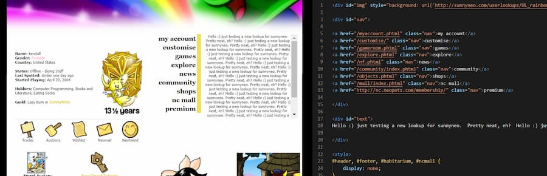
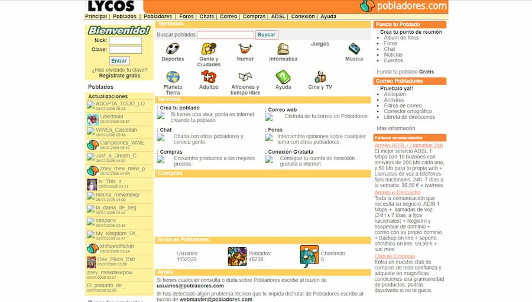

<div class="disclaimer">
En este articulo solo quiero compartir un poco cual ha sido <strong>mi experiencia y como empecé mi carrera como desarrollador</strong>, con esto no estoy intentando imponer que mi manera de hacer las cosas sea la adecuada, cada persona es un mundo y tiene condiciones distintas, sino ayudar a otros con mi experiencia y reflexiones. Yo me sentí muy perdido durante todo el camino.  

He decidido dividir este artículo en diferentes partes que puedes ver aquí:
- Programar y disfrutar todo es empezar (Este artículo)
- El arte de extrapolar (Pronto!)</div>

## El principio

Si me pongo a pensar, creo que tenía unos 9 años cuando **vi por primera vez HTML/CSS** y fue en la gran comunidad conocida como [Neopets](http://www.neopets.com/) (no furro 😛).

Neopets es una especie de juego / comunidad virtual donde controlas tus mascotas, conocidas como neopets. En esta comunidad tenías la posibilidad de personalizar tu perfil y es ahí cuando las plantillas prediseñadas tenían su propio mercado (por ejemplo [sunnyneo](http://www.sunnyneo.com/lookups.php)). Cualquier tipo de tema (anime, libros, películas...) estaba disponible para que pudieras copiarlo y pegarlo. Pero como en toda comunidad, quieres ser algo diferente, asique si querías personalizarlo podías ir directamente al código y cambiar lo que no te gustase ¡Qué herramienta tan poderosa!



Los niños crecen y cuando neopets se quedó algo pequeño me moví a un mundo un poco más diverso (en realidad vi que mi hermano empezar su propio blog). Aunque no hayan sobrevivido a neopets, ambos *[Pobladores Lycos](https://web.archive.org/web/*/pobladores.lycos.es)* y *[Geocities](	http://geocities.yahoo.com/)* marcaron un antes y un después para todos los que querían tener una web personal.



De hecho, **los estándares para la seguridad web eran algo más bajos** e ignoraban los peligros del [XSS💀](https://owasp.org/www-community/attacks/xss/), por lo que podías añadir JavaScript dentro de tu página, por lo que añadir contenido algo más dinámico, enseñar fechas, `alert` , `prompt`, etc. Todo era poco para sorprender a tus usuarios. En cierta manera antes el mundo web estaba tan poco desarrollado que había una diversidad grandísima en cuanto a diseños y soluciones. Aprovecho para revindicar el tag [`marquee`](https://developer.mozilla.org/en-US/docs/Web/HTML/Element/marquee), si trabajas con tecnologías web, por favor, intenta usarlo en el trabajo.

<marquee scrolldelay="30" truespeed="truespeed" direction="right">¡Por un mundo con más marquees en la web!</marquee>

Vale, lo admito, todo esto no lo puedo considerar programar, era más un trabajo de diseño gráfico y maquetación y las pocas partes que requerían algo de programación eran un simple copia y pega cambiando un par de cadenas de texto. Pero indudablemente creo que estas ganas de crear cosas, aprender que **el navegador es un entorno de desarrollo y simplemente el poder jugar con algo visual me dio este primer empujón que todos necesitamos**.

---
## El verdadero principio

**Nadie sabe naciendo programar** (de momento, la realidad puede superar a la ciencia ficción en cualquier momento), así que como todo en esta vida hay una primera vez. Yo he tenido la suerte de ser el menor de 3 hermanos y siempre aprendía algo de ellos: dibujar, hacer judo, disfrutar la lectura... Y claro, aprender a programar fue algo que también puedo presumir de haber heredado de alguna manera. De hecho, esto es una verdad a medias, yo empecé simplemente modificando HTML de Neopets, pero no sabía cuál era la naturaleza de lo que estaba haciendo, asique me corrijo: La primera vez que programe siendo consciente de lo que hacía fue en 2011 (17 años). Y todo empezó con este correo:

> 💌 De: hermano@email.com - Julio 2011
>
>
> Tu primera tarea:
>- Instalar python. //Mi hermano me da algunas instrucciones para instalar python 2.7
>
>Además, quiero que leas la entrada de la wikipedia para python un poco por encima y que encuentres la manera de hacer un "hola mundo" en un programa. No sé si sabes lo que es un "hola mundo", pero seguro que en internet encuentras lo que es ;)
>
>Hay más información sobre python en [http://wiki.python.org](http://wiki.python.org/)
>
>Un abrazo,

Y ese fue el principio de todo, nada más lejos del cliché, un “Hola mundo!", que en Python viene a ser algo así:

```python
 print "Hola mundo!" 
 ```

### Algo >>> Nada

20 caracteres tan solo, pero el enseñar algo por la línea de comandos tiene un poder al principio que aquellos que ya estamos más acostumbrados a ella obviamos pasados unos años. Después del "Hola mundo!" vinieron muchos otros problemas que eran simples pero que me forzaron a mirar en la documentación (complicado en Español 😅) y usar algunos de los conceptos más básicos de la programación (control de flujo, I/O, funciones, tipos...): Revertir el orden de una cadena de texto, imprimir los primeros 100 números pares, imprimir los números pares entre A y B, crear una pequeña calculadora cuyas operaciones se seleccionan de un menú...

**No creo que haya que ser purista cuando empiezas a programar**, lo importante es crear una intuición de cómo se resuelven los problemas y un pensamiento más en términos de algoritmo, sin pensar muchísimo en términos de complejidad o buenas prácticas. La complejidad es algo que te puede ayudar a la larga, a entender un poco mejor la naturaleza de la programación y a no reinventar la rueda. Las buenas prácticas son una herramienta para reducir la capacidad de error humano y facilitar la colaboración. Pero ambas pueden ser un poco inconvenientes cuando lo que quieres entender cómo funcionan o satisfacer tu curiosidad.

```python
	## Imprime todos los numeros primos entre 1 y 30

	# Primer intento
	i = 2
	while i < 100:
		if i == 2:
			print 2
		if i == 3:
			print 3
		# ...
		### Yeah... Ya veis por donde iba		
		i+=1

    # Algo mejor tras aprender sobre funciones, y otras utilidades
	def isPrime(number):
		if number == 1:
			return False 
		for i in range(2, number): 
			if (number % i) == 0: 
				return False
		return True

	for prime_candidate in range(2, 30):
		if isPrime(prime_candidate):
			print(prime_candidate)
```

Al principio daba igual como lo hiciese, lo importante era obtener el resultado que pedía el ejercicio, pero cuantos más ejercicios hacía, el intentar resolverlos de una manera "estática" era más pesado (que no complicado), asique **el pequeño perezoso🦥 que todos llevamos dentro quería ahorrarme tiempo**. Empecé a aprender algo más de algoritmia. Las buenas prácticas fueron más obvias para mi cuando leía el código de otra gente… Pero nunca las interioricé del todo hasta que empecé a trabajar con otros desarrolladores.


### El arte de copiar y deducir

Cuando algún problema se me complicaba, **intentaba hacer trampa**. Es muy fácil buscar un poco por internet y encontrar la solución de otra persona, pero esto no me enseñaba nada, al final del día, si intentaba solucionar un problema similar, y no entendía lo que estaba haciendo, acabaría volviendo a buscar y copiar la respuesta de otra persona.  No me mal entendáis, como dijo *Pablo Picasso* "los buenos artistas copian, los grandes roban", pero hay una gran diferencia entre copiar e intentar copiar algo y entenderlo.


Nunca he sido un erudito, más bien me definiría como un zoquete obstinado. Con un poquito de tiempo aprendí una habilidad que a día de hoy aun me es útil, **leer código, entenderlo y adaptarlo a lo que necesito**. Tengo la firme creencia de que hay que no hay ninguna vergüenza en admitir (esto implica dar crédito 😉 ) que algo ha sido copiado / basado en el trabajo de otra persona, de hecho creo que es una gran fuente de aprendizaje. Solo voy a mencionar algunos de los beneficios.

- **Observar como otros tratan tu problema**, ese cambio de perspectiva, esa diversidad en formas de afrontar un problema... En Computer Science hay una tendencia a usar algoritmos que se pueden generalizar, pero creo que siempre hay cierto encanto en entender la naturaleza de un problema y darle una solución particular que tal vez aproveche mejor cierta característica de este.

- **Aprender algo que**, a lo mejor, **no sabias antes**, ver a alguien con más experiencia y posiblemente más dominio de la tecnología que estas usando a veces te enseña propiedades del lenguaje (sintaxis, utilidades, buenas prácticas...) que tu ignorabas por que eras nuevo.

En resumen, si estas empezando y decides copiar, intenta siempre hacerlo **entendiendo que hace el código que has cogido** de otro sitio.

### Fallar es humano

Creedme cuando os digo que todos, y digo todos, tenemos un inicio y que nunca os pare el sentir que lo que hacéis no es lo suficientemente bueno. **Cualquier habilidad o afición requiere una dedicación, si queréis notar una mejora, practicad**. La práctica no es solo programar, a veces la practica va a ser leer código, dividir problemas, hacerse preguntas... hay muchas maneras de mejorar en este campo ¡No todo va a ser programar!

He cometido muchísimos errores, tanto cuando empecé aprendiendo por mi cuenta como ahora que me dedico profesionalmente al mundo de la ingeniería de software, y creo que sin errores mi curva de aprendizaje hubiese sido mucho más lenta. Es muy importante (para mí al menos), el tener espacio para experimentar, fallar y aprender, tanto en la universidad como en tu mesa de trabajo. Así que si cada vez que fallas te martirizas, intenta darle algo de perspectiva, ¿Cuánto ha sido tu progreso desde esa primera línea de código? ¿Has aprendido algo nuevo de ese fallo (aunque ahora el fallo te parezca obvio)? Da igual a lo que te dediques, arte, deporte, ingeniería, ciencia... Si no te das derecho a fallar, nunca exploraras los límites de lo que haces. *Nota del CTO: Bueno, entiendo que no os arriesguéis a hacer un deploy a producción un viernes por la tarde...*


---

¡Muchas gracias por haber leído hasta aquí! Ha sido mucho hablar de mí mismo, incluso demasiado. Espero que lo poco que he dicho os haya dado un poco de perspectiva. En la siguiente parte hablare un poco más sobre la universidad y de mi carrera profesional en general.

Nos vemos pronto 🖖